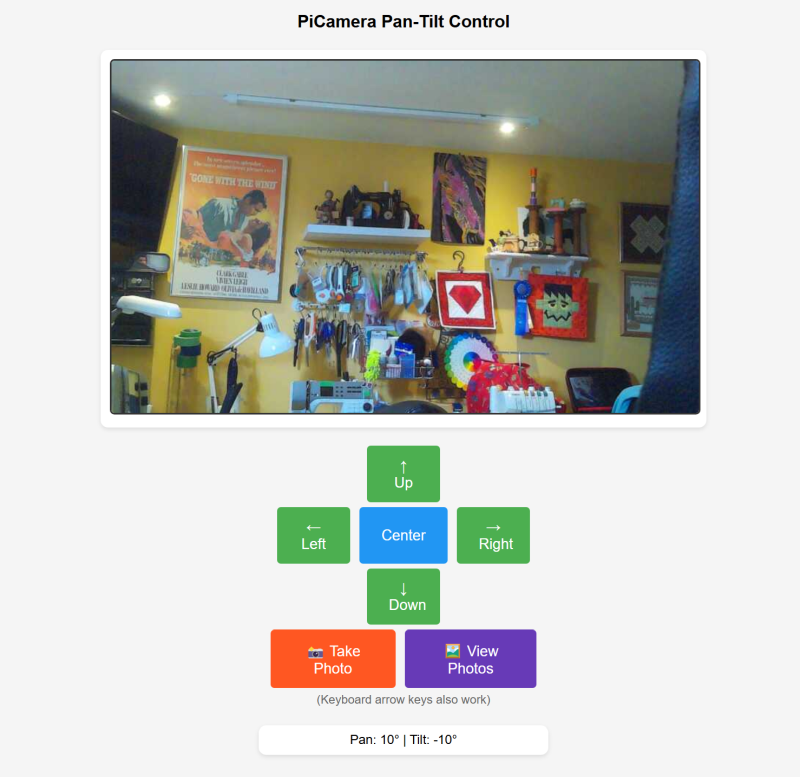

# flask-pantilt-cam.py
A flask python3 low latency live stream pan-tilt web page. Uses Keyboard or mouse buttons to control a pimoroni pantilthat assembly with 
attached pi camera module (Picamera2, Libcamera compatible). 
Has Take Photo and View Photos onscreen buttons.

### Introduction

This program is a python3 flask web server application that allows control of a pimoroni pantilthat with a picamera2 compatible camera module attached.
A web page displays a low latency live camera video stream.
Keyboard arrow keys or on screen navigation buttons control pantilt. A Take Photo button can be used to take, view and save an image to a specified folder.
The Save image folder path will be auto created per config.py setting.
A view photos button brings up a browse thumbnails image grid web page of previously saved images. Click on Thumbnail to view full size image. 

I developed this app completely from scratch using only DeepSeek generative AI prompts for the coding. I did add the import from config.py feature myself,
plus misc edits and fixes. 

I called my DeepSeek AI assistant Codey. The basic version took approximately two hours for the AI interaction and testing on a Raspberry Pi 3B+. 
I started from scratch using just prompts and no example starting code. The Take and View photos feature took quite a bit longer due trouble shooting snd testing issues.

### Requirements

* Raspberry Pi computer (model 3 or greater) with Raspberry OS Bullseye or later (32 or 64 bit).
* Pimoroni pantilthat assembly, installed and working.
* A Pi Camera module (compatible with Picamera2, libcamera python libraries). Installed on pantilthat assembly and working.
* User should be comfortable with working in a terminal or SSH session
* User should have basic skills with computer hardware assembly (pantilt hat), testing and problem solving issues.
* Internet access and local area network is required for installing software from Github and accessing the web page from another computer on you local area network..

### Installation

This was developed for a Raspberry Pi computer running Picamera2, Libcamera python library on , pimoroni or compatible pantilt hat assemby and a picamera2 compatible camera module.

Open a terminal or SSH session and clone the github repository.

    cd ~
    sudo apt update && sudo apt upgrade -y
    git clone https://github.com/pageauc/flask-pantilt-cam.git
    cd flask-pantilt-cam
    chmod +x flask-pantilt-cam.py
	
Edit the config.py settings	
	
	nano config.py
	
Edit the class Config() variable settings as required.

To exit and save nano changes Press Ctrl-x y  

To launch the web server

    ./flask-pantilt-cam.py
	
From a browser on your local network paste the flask url eg

    http://192.168.1.178:5000

### Run in Python Virtual Environment

To run this app in a python3 virtual Environment. If you already have a python3 virtual env with another name, you can use that.

    cd ~
	# If required install virtual environment dependency.
    sudo apt install python3-venv
    # Create a virtual environment, Note you can change venv to another name if desired.
    python -m venv --system-site-packages /home/pi/venv
	# Activate. You will see a different prompt eg (venv) pi@hostname:
    source /home/pi/venv/bin/activate
	# Run in app in the virtual environment
	cd flask-pantilt-cam
    ./flask-pantilt-cam.py
	# When done ctrl-C to stop app
	# To exit the virtual environment
	deactivate
	
### Upgrade

To update your existing cloned project execute the commands below from SSH or Terminal session.

    cd ~/flask-pantilt-cam
	git pull	

### Credits

Claude Pageau developed this application from scatch using only DeepSeek generative AI prompts.  
I called my assistant Codey. It was a rewarding and at times frustrating experience. I started from scratch using just prompts and no example starting code.

GitHub Repo: https://github.com/pageauc/flask-pantilt-cam

